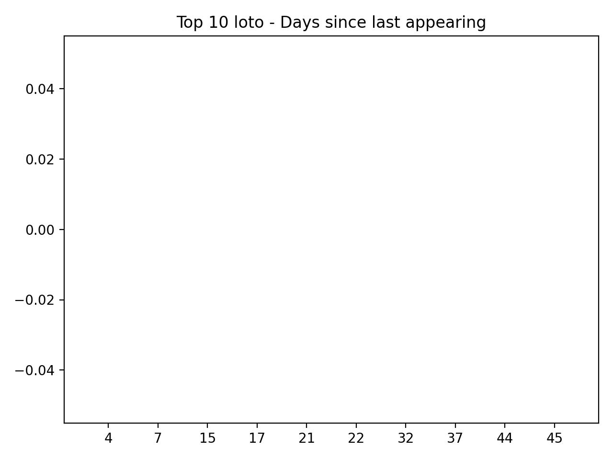
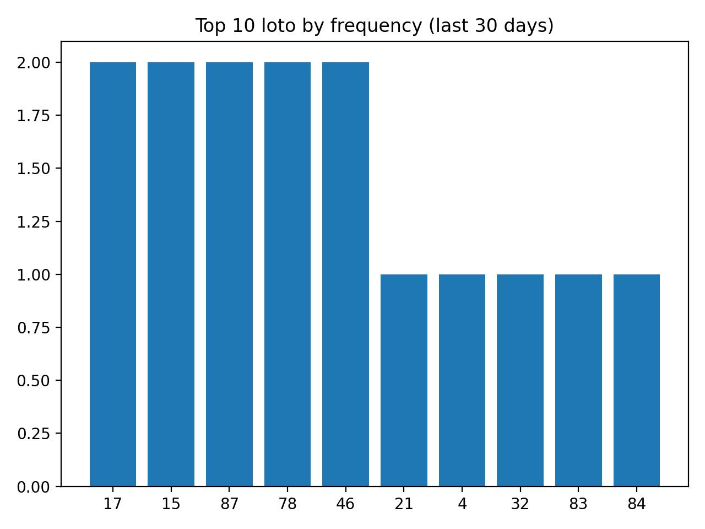
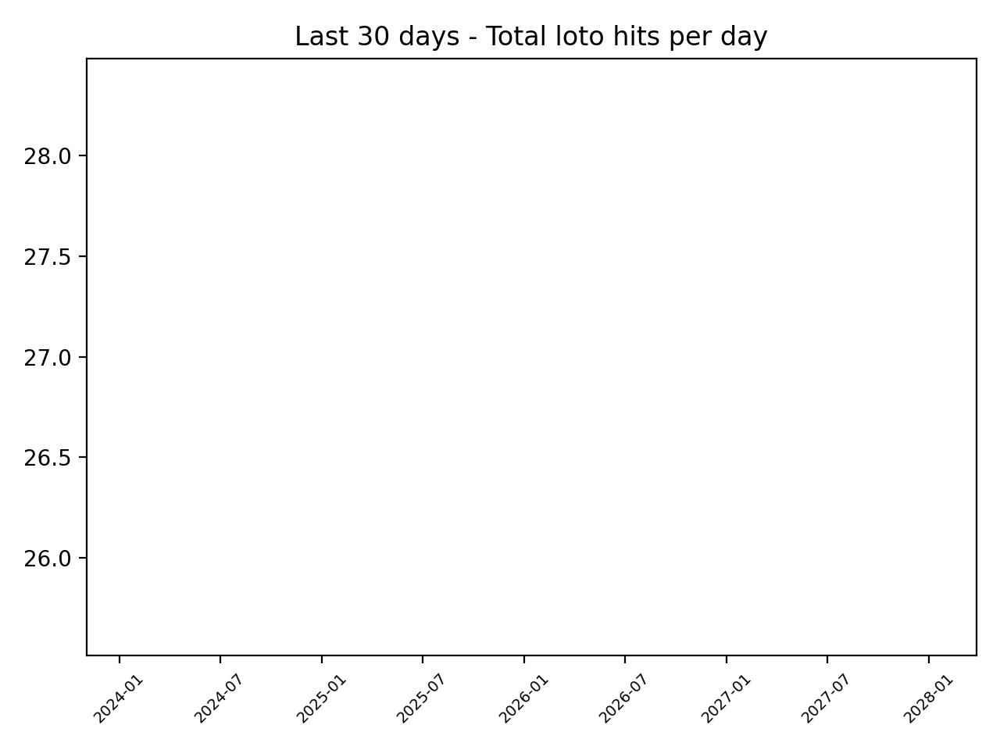
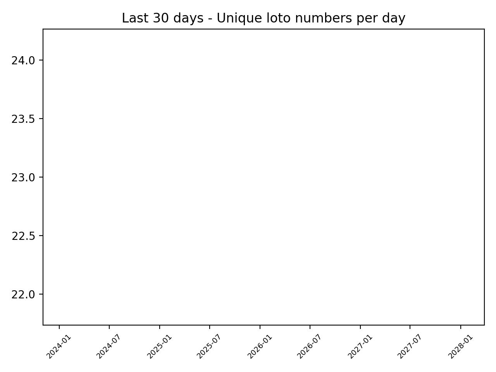
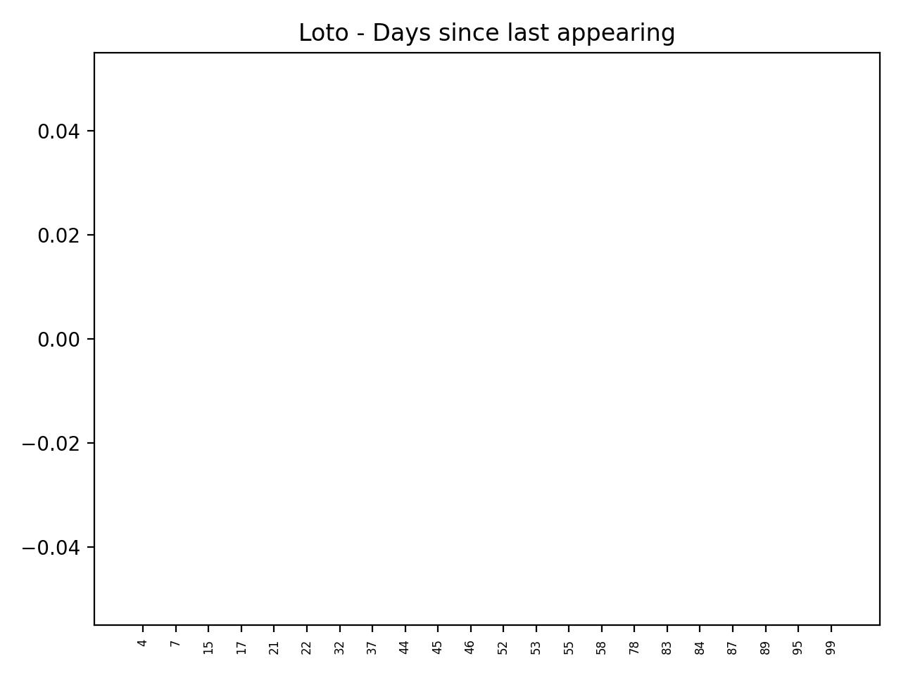
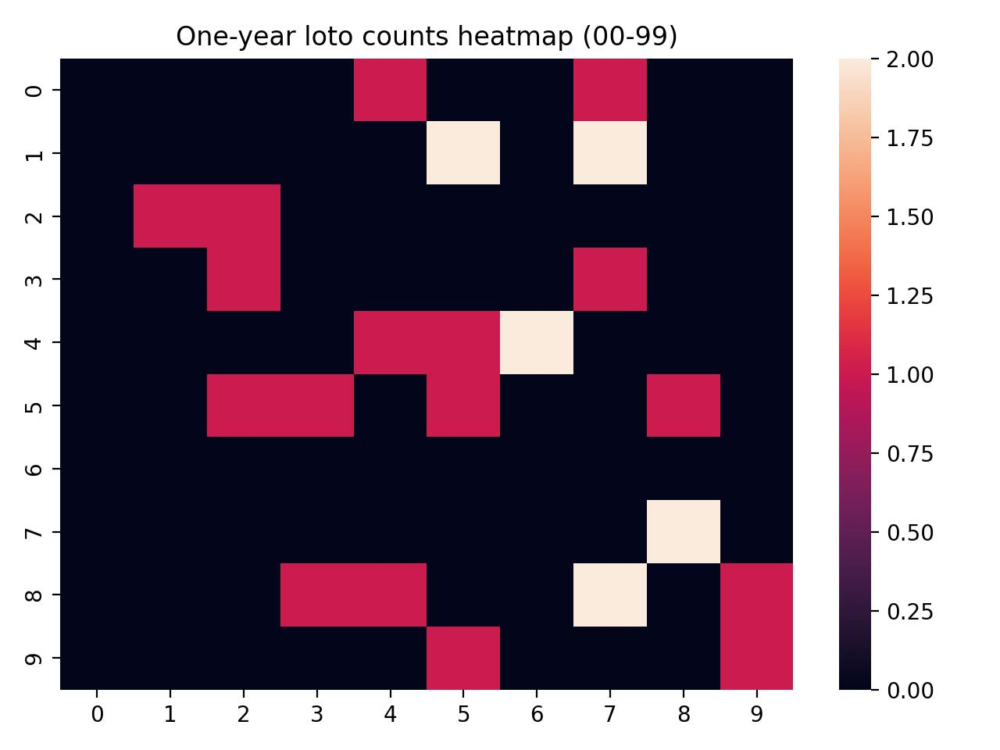
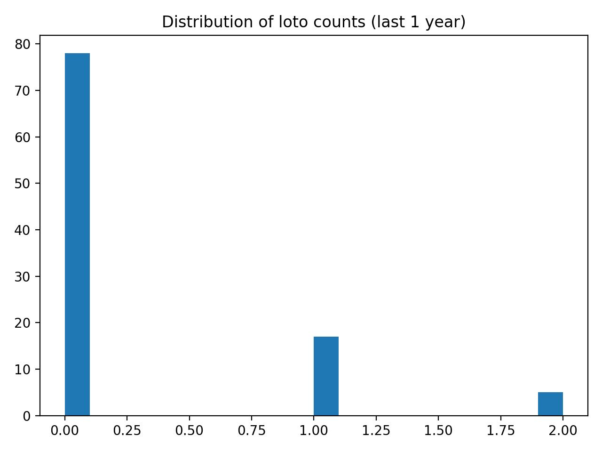

<!doctype html>
<html lang="vi">
<head>
  <meta charset="utf-8" />
  <meta name="viewport" content="width=device-width, initial-scale=1" />
  <title>XSMB Daily Dashboard</title>
  <meta name="description" content="Dashboard XSMB tông sáng, cập nhật tự động mỗi ngày: kết quả mới nhất, lịch 7 ngày, top 10 lâu chưa về, 30 ngày và biểu đồ." />

  
</head>

<body>
  

    

      

        

          

            

            

              <h1>XSMB Daily Dashboard</h1>
              
Tông sáng • LED 7 màu • Update 18:30 VN (retry ~5 phút nếu trễ)

            

          

          

            

              
              Đang tải dữ liệu…
            

            
Updated (VN): —

            
SHA: —

            
Run: —

            

              <a class="btn" href="./data/xsmb.json">xsmb.json</a>
              <a class="btn" href="./data/last7.json">last7.json</a>
              <a class="btn" href="./data/site_meta.json">meta</a>
            

          

        

      

    

    

      <!-- 1) Kết quả mới nhất -->
      

        

          <h2 style="margin:0">Kết quả mới nhất</h2>
          
Nguồn: —

        

        
—

        

          

            
Ngày

            
—

          

          

            
Giải đặc biệt

            
—

          

          

            
Đề (2 số cuối ĐB)

            
—

          

        

        

          <table class="table" aria-label="Bảng kết quả xổ số">
            <thead>
              <tr><th style="width:170px">Giải</th><th>Kết quả</th></tr>
            </thead>
            <tbody id="resultRows">
              <tr><td style="color:var(--muted)">Đang tải…</td><td style="color:var(--muted)">—</td></tr>
            </tbody>
          </table>
        

        

          
© Auto generated by GitHub Actions

          
Top10: <a href="./data/top10_delta.json">delta</a> • <a href="./data/top10_30d.json">30d</a>

        

      

      <!-- ✅ 2) Lịch 7 ngày nằm dưới KQ mới nhất -->
      

        <h2>Lịch gần nhất 7 ngày (full)</h2>
        

          <table class="table" id="last7Table" aria-label="Lịch 7 ngày">
            <thead>
              <tr>
                <th>Ngày</th>
                <th>ĐB</th>
                <th>Nhất</th>
                <th>Nhì</th>
                <th>Ba</th>
                <th>Tư</th>
                <th>Năm</th>
                <th>Sáu</th>
                <th>Bảy</th>
              </tr>
            </thead>
            <tbody>
              <tr><td colspan="9" style="color:var(--muted)">Đang tải…</td></tr>
            </tbody>
          </table>
        

      

      <!-- 3) Top10 & chart -->
      

        <h2>Top 10</h2>

        

          

            <h3>Top 10 số lâu chưa về (text)</h3>
            

              <table class="table" id="top10DeltaTable">
                <thead><tr><th>#</th><th>Số</th><th>Delta (ngày)</th></tr></thead>
                <tbody><tr><td colspan="3" style="color:var(--muted)">Đang tải…</td></tr></tbody>
              </table>
            

          

          

            <h3>Top 10 (30 ngày) (text)</h3>
            

              <table class="table" id="top10_30dTable">
                <thead><tr><th>#</th><th>Số</th><th>Lượt</th></tr></thead>
                <tbody><tr><td colspan="3" style="color:var(--muted)">Đang tải…</td></tr></tbody>
              </table>
            

          

        

        

          

            <h3>Top 10 lâu chưa về (chart)</h3>
            
          

          

            <h3>Top 10 (30 ngày) (chart)</h3>
            
          

        

      

      <!-- 4) Biểu đồ -->
      

        <h2>Biểu đồ</h2>
        

          
<h3>Line 30D Total</h3>

          
<h3>Line 30D Unique</h3>

        

        

          
<h3>Delta (00–99)</h3>

          
<h3>Heatmap (1 year)</h3>

        

        

          
<h3>Top 10 (1 year)</h3>

          
<h3>Distribution (1 year)</h3>

        

      

    

  

  
</body>
</html>
